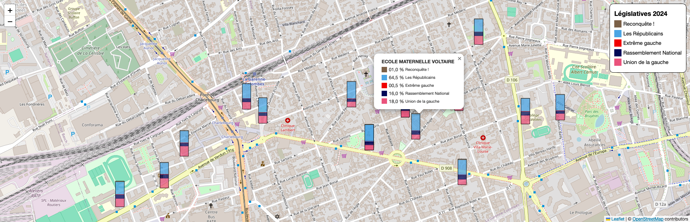
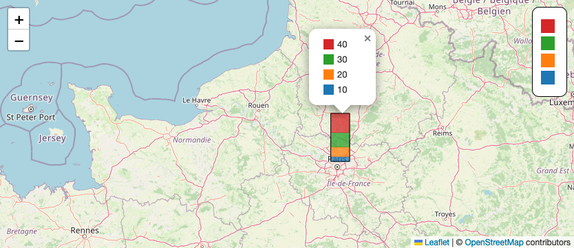
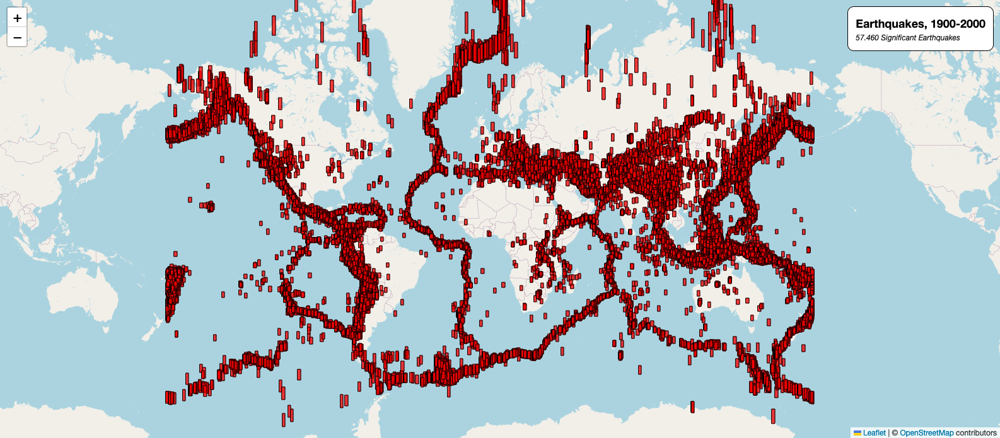

# Leaflet.BarChart


**Leaflet.BarChart** is a leaflet plugin for addin bar charts on a leaflet map.

Made with ❤️ by [Richard Carlier](https://www.linkedin.com/in/rcarlier/) at _La Garenne Colombes_ (France).



## Usage

You need to include the `leaflet` CSS/JS and `Leaflet.BarChart` CSS/JS (you can customize CSS)

```html
<link rel="stylesheet" href="lib/leaflet.min.css" />
<link rel="stylesheet" href="lib/leaflet.barChart.min.css" />

<script src="lib/leaflet.min.js"></script>
<script src="lib/leaflet.barChart.min.js"></script>
```

<mark>@soon</mark> : CDN ...

You can create barCharts with `L.barChart()`, and add it to map.

The minimum chart is:

```js
L.barChart({
    lat: 49.27119,
    lng: 4.06494,
    values: [10, 20, 30, 40],
}).addTo(map);
```

Data can also be an array of values

```js
let data = [
    { lat: 47.24188, lng: -1.58066, values: [20, 45, 35], label: "Nantes" },
    { lat: 47.51892, lng: -0.58228, values: [45, 45, 10], label: "Angers" },
    { lat: 47.41641, lng: 0.65918, values: [45, 55, 0], label: "Tours" },
];
L.barChart(data).addTo(map);
```

## Data

| Options        | Type   | Option?  | Aim                               |
| -------------- | ------ | -------- | --------------------------------- |
| `lat`          | Float  | required | Latitude...                       |
| `lng` or `lon` | Float  | required | Longitude...                      |
| `values`       | Array  | required | Array of values, all of same size |
| `label`        | String | optional | Name of bar (city, country...)    |

## Options

As second parameter, you can specify options.

| Options             | Type    | Default    | Aim                                                                                              |
| ------------------- | ------- | ---------- | ------------------------------------------------------------------------------------------------ |
| `colors`            | Array   | see bellow | Colors bars. If there not enought color, it's cycling. 2 minimum.                                |
| `width`             | Float   | 0.3        | Width, in degrees of longitude (changing with zoom)                                              |
| `height`            | Float   | 1.5        | Height, in degrees of longitude (changing with zoom) - not used if zoom is set (but required...) |
| `zoom`              | Float   | null       | If set, bar is drawn with real data, multiplicated by zoom (see EarthQuakes example)             |
| `legend`            | Array   | []         | Legend for each value ; must be same size of array                                               |
| `legendPos`         | String  | `topright` | Position of the legend `bottomleft`, `bottomright`, `topleft` or `topright`                      |
| `title`             | String  | ""         | Title of chart                                                                                   |
| `subTitle`          | String  | ""         | Sub-title of chart                                                                               |
| `fillOpacity`       | Float   | 0.75       | Opacity of colors, from 0 to 1...                                                                |
| `unit`              | String  | ""         | Can add a unit text after numbers, like `%`, `€`, `$` or `Kg`                                    |
| `unitPos`           | String  | `after`    | Specify position of unit : `after` or `before`                                                   |
| `unitDecimal`       | Integer | Null       | Round to decimal, add 0 to fixed                                                                 |
| `unitZerofill`      | Integer | Null       | Number of 0 before, add 0 to pad                                                                 |
| `showLegend`        | Boolean | true       | Show legend in panel                                                                             |
| `showLegendInPopup` | Boolean | false      | Show legend in popup                                                                             |

Default colors:


## Exemples

See `examples/` folder for full examples...

### Sample minimal



The most minimalist...

```js
// Create map
var map = L.map("map").setView({ lat: 48.90948, lng: 2.24679 }, 7);
// Add tileLayer
L.tileLayer("https://{s}.tile.openstreetmap.org/{z}/{x}/{y}.png", {
    attribution: "[...]",
}).addTo(map);
// Add chart... ;-)
L.barChart({
    lat: 48.90948,
    lng: 2.24679,
    values: [10, 20, 30, 40],
}).addTo(map);
```

### Legislatives 2024 - La Garenne Colombes


#### Options used :

```json
{
    "title": "Législatives 2024",
    "legend": ["UG", "RN", "EXG", "LR", "REC"],
    "unit": "%",
    "colors": ["#EA537C", "#000957", "#F00000", "#4BA5E4", "#7B6047"],
    "width": 0.0005,
    "height": 0.001,
    "unitDecimal": 1,
    "unitZerofill": 2,
    "showLegendInPopup": true
}
```

#### Data source :

-   [Géolocalisation des bureaux de vote](https://www.data.gouv.fr/fr/datasets/geolocalisation-des-bureaux-de-vote/)
-   [Élections législatives du 30 juin 2024 - Résultats définitifs du 1er tour](https://www.data.gouv.fr/fr/datasets/elections-legislatives-des-30-juin-et-7-juillet-2024-resultats-definitifs-du-1er-tour/)
-   And some Python code to clean it all up... Sorted by panel number on the electoral lists...

### Earthquakes

Not the best tool to see this, but as a crash test...



#### Options used :

```json
{
    "title": "Earthquakes, 1900-2000",
    "subTitle": "57.460 Significant Earthquakes",
    "colors": ["#FF0000"],
    "width": 1.5,
    "height": 0,
    "zoom": 0.5,
    "showLegendInPopup": false,
    "showLegend": false
}
```

#### Note :

-   `height` is not used, because `zoom` is set...

#### Data source :

-   [Significant Earthquakes, 1900-Present](https://www.kaggle.com/datasets/usamabuttar/significant-earthquakes)
-   And some Python code to clean it...
